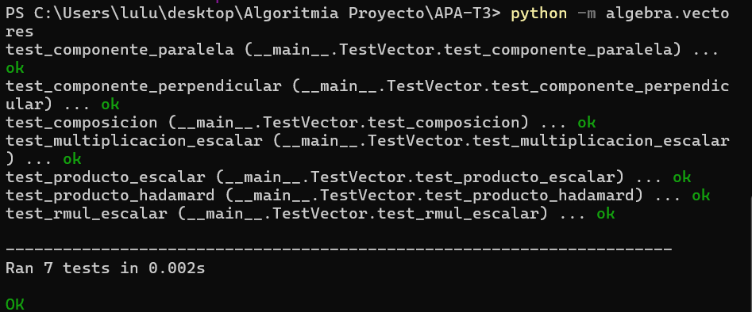

# Tercera tarea de APA: Multiplicación de vectores y ortogonalidad

## Nom i cognoms

> [!Important]
> Introduzca a continuación su nombre y apellidos:
>
> Lulu Armoire Palomar

## Aviso Importante

> [!Caution]
>
> 
> El objetivo de esta tarea es programar en Python usando el pardigma de la programación
> orientada a objeto. Es el alumno quien debe realizar esta programación. Existen bibliotecas
> que, si lugar a dudas, lo harán mejor que él, pero su uso está prohibido.
>
> ¿Quiere saber más?, consulte con el profesorado.
  
## Fecha de entrega: 6 de abril a medianoche

## Clase Vector e implementación de la multiplicación de vectores

El fichero `algebra/vectores.py` incluye la definición de la clase `Vector` con los
métodos desarrollados en clase, que incluyen la construcción, representación y
adición de vectores, entre otros.

Añada a este fichero los métodos siguientes, junto con sus correspondientes
tests unitarios.

### Multiplicación de los elementos de dos vectores (Hadamard) o de un vector por un escalar

- Sobrecargue el operador asterisco (`*`, correspondiente a los métodos `__mul__()`,
  `__rmul__()`, etc.) para implementar el producto de Hadamard (vector formado por
  la multiplicación elemento a elemento de dos vectores) o la multiplicación de un
  vector por un escalar.

  - La prueba unitaria consistirá en comprobar que, dados `v1 = Vector([1, 2, 3])` y
    `v2 = Vector([4, 5, 6])`, la multiplicación de `v1` por `2` es `Vector([2, 4, 6])`,
    y el producto de Hadamard de `v1` por `v2` es `Vector([4, 10, 18])`.

- Sobrecargue el operador arroba (`@`, multiplicación matricial, correspondiente a los
  métodos `__matmul__()`, `__rmatmul__()`, etc.) para implementar el producto escalar
  de dos vectores.

  - La prueba unitaria consistirá en comprobar que el producto escalar de los dos
    vectores `v1` y `v2` del apartado anterior es igual a `32`.

### Obtención de las componentes normal y paralela de un vector respecto a otro

Dados dos vectores $v_1$ y $v_2$, es posible descomponer $v_1$ en dos componentes,
$v_1 = v_1^\parallel + v_1^\perp$ tales que $v_1^\parallel$ es tangencial (paralela) a
$v_2$, y $v_1^\perp$ es normal (perpendicular) a $v_2$.

> Se puede demostrar:
>
> - $v_1^\parallel = \frac{v_1\cdot v_2}{\left|v_2\right|^2} v_2$
> - $v_1^\perp = v_1 - v_1^\parallel$

- Sobrecargue el operador doble barra inclinada (`//`, métodos `__floordiv__()`,
  `__rfloordiv__()`, etc.) para que devuelva la componente tangencial $v_1^\parallel$.

- Sobrecargue el operador tanto por ciento (`%`, métodos `__mod__()`, `__rmod__()`, etc.)
  para que devuelva la componente normal $v_1^\perp$.

> Es discutible esta elección de las sobrecargas, dado que extraer la componente
> tangencial no es equivalente a ningún tipo de división. Sin embargo, está
> justificado en el hecho de que su representación matemática es dos barras
> paralelas ($\parallel$), similares a las usadas para la división entera (`//`).
>
> Por otro lado, y de manera *parecida* (aunque no idéntica) al caso de la división
> entera, las dos componentes cumplen: `v1 = v1 // v2 + v1 % v2`, lo cual justifica
> el empleo del tanto por ciento para la componente normal.

- En este caso, las pruebas unitarias consistirán en comprobar que, dados los vectores
  `v1 = Vector([2, 1, 2])` y `v2 = Vector([0.5, 1, 0.5])`, la componente de `v1` paralela
  a `v2` es `Vector([1.0, 2.0, 1.0])`, y la componente perpendicular es `Vector([1.0, -1.0, 1.0])`.

### Entrega

#### Fichero `algebra/vectores.py`

- El fichero debe incluir una cadena de documentación que incluirá el nombre del alumno
  y los tests unitarios de las funciones incluidas.

- Cada función deberá incluir su propia cadena de documentación que indicará el cometido
  de la función, los argumentos de la misma y la salida proporcionada.

- Se valorará lo pythónico de la solución; en concreto, su claridad y sencillez, y el
  uso de los estándares marcados por PEP-ocho.

#### Ejecución de los tests unitarios

Inserte a continuación una captura de pantalla que muestre el resultado de ejecutar el
fichero `algebra/vectores.py` con la opción *verbosa*, de manera que se muestre el
resultado de la ejecución de los tests unitarios.




#### Código desarrollado

Inserte a continuación el código de los métodos desarrollados en esta tarea, usando los
comandos necesarios para que se realice el realce sintáctico en Python del mismo (no
vale insertar una imagen o una captura de pantalla, debe hacerse en formato *markdown*).

```python 
class Vector:
    
    # Estandares universales
    
    """
    Classe para representar vectores y operaciones vectoriales
    """
    def __init__(self, iterable):
        """
        Constructor de Vector.
        Args: iterable (lista, tupla, etc.): coordenadas del vector
        """
        self.coordenadas = list(iterable)  # Convertimos a lista por si es tupla
    
    def __repr__(self):
        """
        Representación oficial del vector para depuración
        """
        return f"Vector({self.coordenadas})"
    
    def __str__(self):
        """
        Representación amigable para el usuario
        """
        return str(self.coordenadas)
    
    def __len__(self):
        """
        Devuelve la dimensión del vector
        """
        return len(self.coordenadas)
    
    def __getitem__(self, i):
        """
        Permite acceder a v[i] para obtener la coordenada i
        """
        return self.coordenadas[i]
    
    def __eq__(self, other):
        """
        Compara dos vectores para igualdad
        """
        if not isinstance(other, Vector):
            return False
        return self.coordenadas == other.coordenadas

# Inicio Tarea 
    
    def __mul__(self, other):
        """
        Multiplica un vector por un escalar o realiza el producto de Hadamard.

        Args:
            other (int, float o Vector): Si es número, multiplica cada coordenada.
                                    Si es Vector, multiplica elemento a elemento.

        Salida:
            Vector: Nuevo vector con el resultado.

        """
        # Caso 1: multiplicación escalar
        if isinstance(other, (int, float)):
            nuevas = []
            for x in self.coordenadas: # recorremos cada coordenada
                nuevas.append(x * other) # multiplicamos y añadimos
            return Vector(nuevas)
    
        # Caso 2: multiplicación por otro vector (Hadamard)
        if isinstance(other, Vector): # si other es un vector
            nuevas = []
            for i in range(len(self.coordenadas)):
                nuevas.append(self.coordenadas[i] * other.coordenadas[i])
            return Vector(nuevas)
    
        raise TypeError("No se puede multiplicar")
    
# Ahora creamos __rmul__ por si encontramos un caso que sea 2 * v1. Python como empieza a leer por la izquierda, primero intenta con (2).__mul__(v1) y falla. Entonces, automáticamente, prueba con v1.__rmul__(2). Por eso necesitamos __rmul__, para que el vector sepa multiplicarse cuando el número está a la izquierda

    def __rmul__(self, other):
        """
        Multiplica un escalar por un vector (operación conmutativa).

        Args:
            other (int, float): Escalar que multiplica al vector.

        Salida:
            Vector: Nuevo vector con cada coordenada multiplicada por el escalar.
        """
        return self.__mul__(other)   # Reutiliza __mul__ 

    def __matmul__(self, other):
        """
        Calcula el producto escalar de dos vectores usando el operador @.

        Args:
            other (Vector): Segundo vector.

        Salida:
            float or int: Suma de los productos elemento a elemento.
        """
        # Solo se puede multiplicar vector por vector
        if not isinstance(other, Vector):
            raise TypeError(f"No se puede hacer producto escalar de Vector con algo que no sea otro vector")
    
        # Comprobar dimensión
        if len(self.coordenadas) != len(other.coordenadas):
            raise ValueError("Los vectores deben tener la misma dimensión")
    
        # Hacemos la suma de productos
        resultado = 0  
        for i in range(len(self.coordenadas)):
            resultado = resultado + (self.coordenadas[i] * other.coordenadas[i])
        
        return resultado

    def __rmatmul__(self, other):
        """
        Producto escalar con escalar a la izquierda (no permitido)

        Args:
            other: Cualquier tipo (número, etc.)

        Salida:
            None: No retorna nada
        """
        raise TypeError(f"No se puede hacer producto escalar de {type(other)} con Vector")

    def __floordiv__(self, other):
        """
        Calcula la componente paralela de un vector respecto a otro

        Args:
            other (Vector): Vector de referencia para la proyección

        Salida:
            Vector: Componente tangencial (paralela) de self respecto a other
        """
        if not isinstance(other, Vector): # Si other NO es un Vector
            raise TypeError("// solo puede ser entre vectores")

        # calcular producto escalar v1 · v2
        producto_escalar = 0
        for i in range(len(self.coordenadas)):
            producto_escalar = producto_escalar + (self.coordenadas[i] * other.coordenadas[i])
        # v2 al cuadrado 
        v2_cuadrado = 0
        for i in range(len(other.coordenadas)):
            v2_cuadrado = v2_cuadrado + (other.coordenadas[i] * other.coordenadas[i])

        # comprovar que v2 no sea 0 
        if v2_cuadrado == 0:
            raise TypeError("No se puede proyectar sobre el vector cero")

        # Calcular factor
        factor = producto_escalar / v2_cuadrado

        # Multiplicar cada coordenada de other por el factor
        nuevas_coordenadas = []
        for i in range(len(other.coordenadas)):
            nuevas_coordenadas.append(other.coordenadas[i] * factor)
    
        return Vector(nuevas_coordenadas)

    def __rfloordiv__(self, other):
        """ 
        Evita que se haga la operacion entre algo que no son dos vectores
        """
        raise TypeError(f"No se puede hacer //")

    def __mod__(self, other):
        """
        Calcula la componente perpendicular de un vector respecto a otro.

        Args:
             other (Vector): Vector de referencia.

        Salida:
            Vector: Componente normal (perpendicular) de self respecto a other
        """
        if not isinstance(other, Vector):
            raise TypeError("% solo entre Vectores")
    
        # Calculamos la componente paralela usando //
        paralela = self // other
    
        # Restamos v1 - v1∥
        nuevas_coordenadas = []
        for i in range(len(self.coordenadas)):
            nuevas_coordenadas.append(self.coordenadas[i] - paralela.coordenadas[i])
    
        return Vector(nuevas_coordenadas)

    def __rmod__(self, other):
        """
        Evita que se haga la operacion entre algo que no son dos vectores
        """
        raise TypeError(f"No se puede hacer % con {type(other)} y Vector")


# test unitarios
if __name__ == '__main__':
    import unittest

    class TestVector(unittest.TestCase):
        
        def test_multiplicacion_escalar(self):
            v1 = Vector([1, 2, 3])
            resultado = v1 * 2
            self.assertEqual(resultado, Vector([2, 4, 6]))
        
        def test_producto_hadamard(self):
            v1 = Vector([1, 2, 3])
            v2 = Vector([4, 5, 6])
            resultado = v1 * v2
            self.assertEqual(resultado, Vector([4, 10, 18]))
        
        def test_rmul_escalar(self):
            v1 = Vector([1, 2, 3])
            resultado = 2 * v1
            self.assertEqual(resultado, Vector([2, 4, 6]))
        
        def test_producto_escalar(self):
            v1 = Vector([1, 2, 3])
            v2 = Vector([4, 5, 6])
            resultado = v1 @ v2
            self.assertEqual(resultado, 32)
        
        def test_componente_paralela(self):
            v1 = Vector([2, 1, 2])
            v2 = Vector([0.5, 1, 0.5])
            resultado = v1 // v2
            esperado = Vector([1.0, 2.0, 1.0])
            for a, b in zip(resultado.coordenadas, esperado.coordenadas):
                self.assertAlmostEqual(a, b)
        
        def test_componente_perpendicular(self):
            v1 = Vector([2, 1, 2])
            v2 = Vector([0.5, 1, 0.5])
            resultado = v1 % v2
            esperado = Vector([1.0, -1.0, 1.0])
            for a, b in zip(resultado.coordenadas, esperado.coordenadas):
                self.assertAlmostEqual(a, b)
        
        def test_composicion(self):
            v1 = Vector([2, 1, 2])
            v2 = Vector([0.5, 1, 0.5])
            paralela = v1 // v2
            perpendicular = v1 % v2
            suma = Vector([a + b for a, b in zip(paralela.coordenadas, perpendicular.coordenadas)])
            self.assertEqual(v1, suma)
    
    unittest.main(verbosity=2)
    ```

#### Subida del resultado al repositorio GitHub y *pull-request*

La entrega se formalizará mediante *pull request* al repositorio de la tarea.

El fichero `README.md` deberá respetar las reglas de los ficheros Markdown y
visualizarse correctamente en el repositorio, incluyendo la imagen con la ejecución de
los tests unitarios y el realce sintáctico del código fuente insertado.
